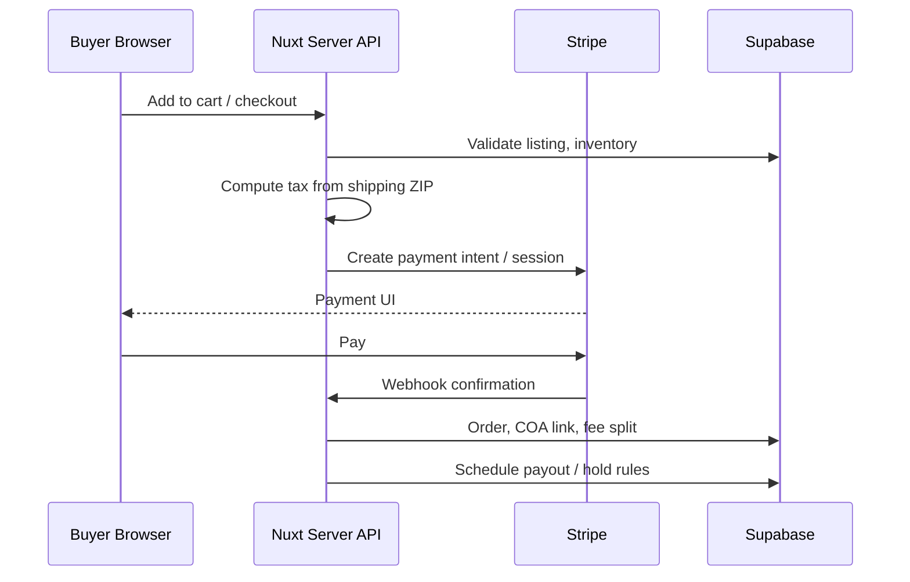

# Architecture

System design for The Franks Standard marketplace platform.

---

## Stack

| Layer | Technology |
|-------|------------|
| Frontend | Nuxt 3 (Vue 3) |
| API | Nitro `server/api` routes |
| Database | Supabase (PostgreSQL) |
| Auth | Supabase Auth + session middleware |
| Payments | Stripe Checkout / Connect |
| Storage | Supabase storage (COA uploads, media) |
| Background | Cron scripts (`backend/cron/`) |
| AI | Chat router, phone router, knowledge base |

---

## Request Flow (Typical Purchase)

---

## Multi-Vendor Model

- Each **seller** owns a **store** profile
- **Listings** belong to stores; orders line-items reference listing snapshots
- **Platform fee** deducted per line at settlement
- **B&C lane** — store metadata flag for fee qualification and marketing context

---

## COA Subsystem

1. Seller uploads document at listing (or post-list per policy)
2. Backend hashes file, stores path, writes audit log
3. Serialized COA assigns unique serial in DB
4. Order creation copies COA reference to order record
5. Verification endpoint checks serial ↔ listing/order linkage

---

## Financial Pipeline

- Gross capture via Stripe
- Sales tax component separated per facilitator rules
- Platform fee netted
- Seller net to Connect account per schedule
- **25% owner business income tax reserve** — backend allocation for operator accounting (see payments doc)
- Wholesale instant transfer to distributor nodes where configured

---

## Dispute & Fraud Pipelines

- Dispute state machine: opened → seller_response → escalated → resolved
- Fraud signals: user reports + automated heuristics (device, IP, messaging)
- Owner queues: `manual_fraud_review`, `manual_dispute_review`
- Actions: freeze, ban, payout hold via owner action handlers

---

## Search & Index

- Listing documents indexed for full-text and filters
- Owner action: `reindex-search` for rebuild
- Recommendations layer uses purchase/browse signals (see search doc)

---

## AI Agents

| Agent | Entry | Knowledge |
|-------|-------|-----------|
| Chat | `server/api/ai/chat.post.ts` | `backend/ai_chat_agent/knowledge_base/*` |
| Phone | `backend/ai_phone_agent/router.js` | Scripts + verification prompts |

Escalation when user requests policy override, LE action, or refund guarantee.

---

## Owner Subsystem

`server/api/owner/*` exposes:

- **status/** — platform, financial, fraud, disputes, security, users, stores
- **actions/** — ban, freeze, cache, backup, reindex, etc.
- **logs/** — activity, fraud, disputes, payouts, violations, security
- **export** — audit export

Backed by `backend/owner/*` scripts.

---

## Deployment Notes

- Launch validation: `backend/launch/validate_platform.js`
- Post-launch monitor: `backend/cron/post_launch_monitor.js`
- Lockdown check: `backend/owner/final_lockdown_check.js`

Environment secrets: Stripe keys, Supabase service role, owner auth—never client-exposed.

---

## Brand Isolation

- Franks: `pages/index.vue` marketplace shell density (search bar, departments, cards)
- B&C: separate route namespace, dark theme, competition catalog
- Shared: checkout, tax, COA, disputes, owner tools

---

## Related

- [security.md](security.md)
- [owner_tools.md](owner_tools.md)
- [api_overview.md](api_overview.md)
